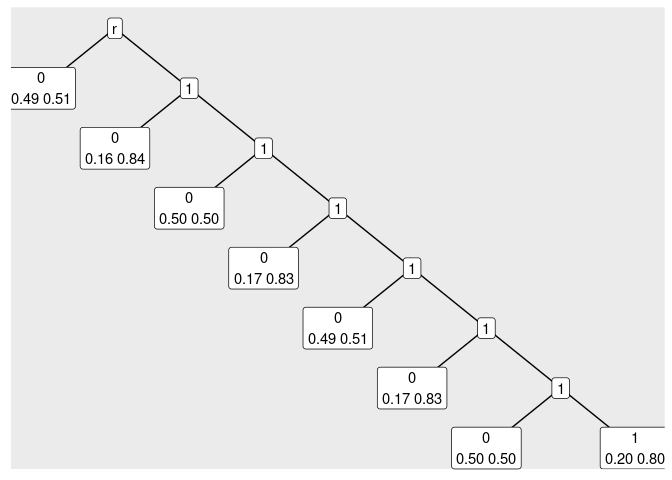

<!-- README.md is generated from README.Rmd. Please edit that file -->

# vlmcmethods

<!-- badges: start -->
<!-- badges: end -->

Methods for Variable-Length Markov Chain models…

## Installation

Install the development version from [GitHub](https://github.com/) with:

``` r
# install.packages("devtools")
devtools::install_github("Freguglia/vlmcmethods")
```

## Example

``` r
library(vlmcmethods)
# Example dataset format
str(binchain)
#> List of 4
#>  $ 1: num [1:2500] 0 1 0 0 1 0 0 0 0 1 ...
#>  $ 2: num [1:2500] 0 1 0 1 0 1 0 1 1 1 ...
#>  $ 3: num [1:2500] 1 1 1 0 1 1 0 1 1 0 ...
#>  $ 4: num [1:2500] 1 1 1 1 1 1 0 1 1 1 ...

# Fitting VLMC via context algorithm
fit <- vlmcfit(binchain, Hmax = 8, cutoff = 10)
fit
#> [1] "{r0,r10,r110,r1110,r11110,r111110,r1111110,r1111111}"

# Plotting trees
tree_plot(fit)
```



``` r
# Obtain a tbl_graph object from the fitted tree (string)
graph <- tree_graph(fit)
graph
#> # A tbl_graph: 15 nodes and 14 edges
#> #
#> # A rooted tree
#> #
#> # Node Data: 15 x 2 (active)
#>   name    last 
#>   <chr>   <chr>
#> 1 r0      0    
#> 2 r10     0    
#> 3 r110    0    
#> 4 r1110   0    
#> 5 r11110  0    
#> 6 r111110 0    
#> # … with 9 more rows
#> #
#> # Edge Data: 14 x 2
#>    from    to
#>   <int> <int>
#> 1     9     7
#> 2     9     8
#> 3    10     6
#> # … with 11 more rows
# You can use this object within the 'ggraph' package to create 
# custom visualizations
```
